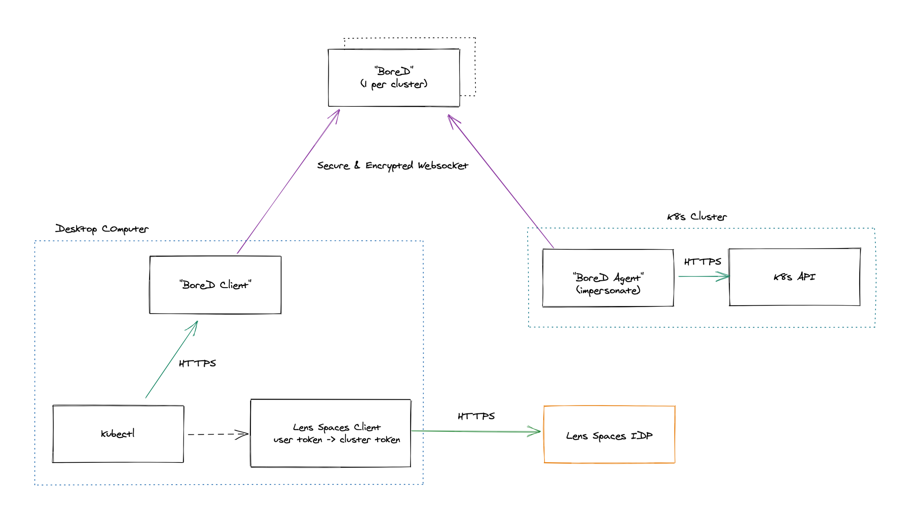

# BoreD

```
bore (verb)
/bɔː/
```

> Make (a hole) in something with a tool or by digging.

A reverse tunnel daemon designed for [Lens](https://github.com/lensapp/lens).



See also [BoreD Agent](https://github.com/lensapp/bored-agent) repository.

(c) Copyright 2021 Mirantis Inc, all rights reserved.
